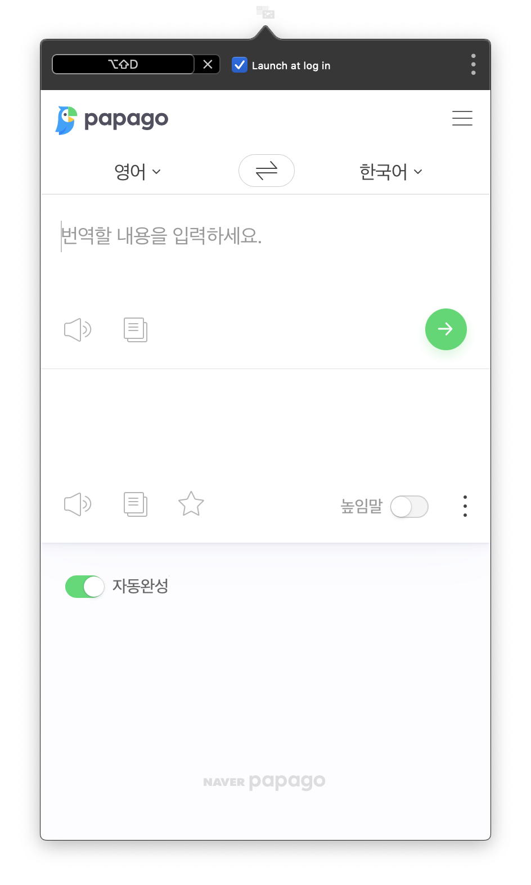

# POP Translator

빠르게 번역기를 사용하고 싶은데, 마땅한 프로그램이 없어 직접 구현하였습니다.

[올ㅋ사전](http://allkdic.xoul.kr)에 영감을 받았습니다.

어디서든 `⌥` +`⇧` +`D ` 를 입력하면 번역기를 사용할 수 있습니다.

## [Download](https://github.com/LeeGwangYong/POP-Translator/releases/latest)

## Feature

- 로그인 시 시작하기
- 단축키 사용, 수정
- 번역기 전환
  - Google
  - Papago
  - Kakao i

이슈나 의견은 rhkdrmfh@gmail.com 혹은 PR을 남겨주세요.